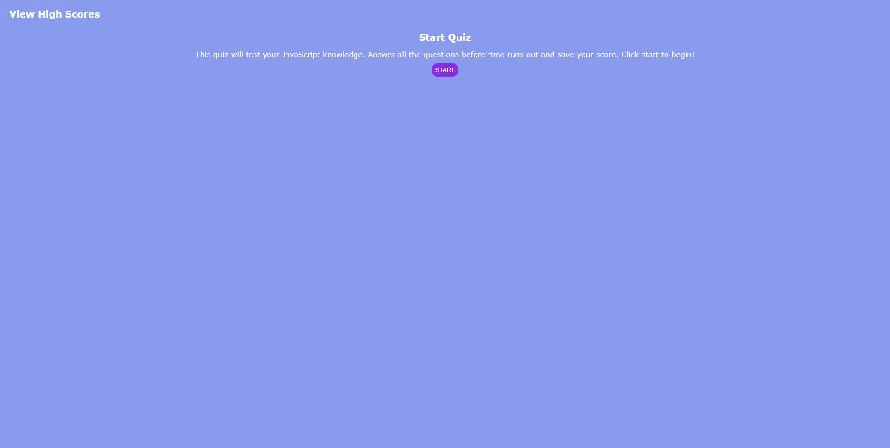
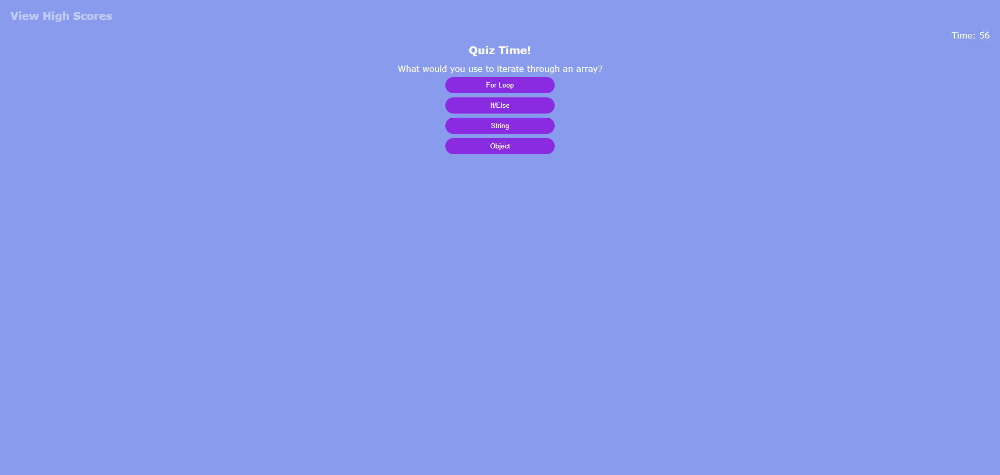
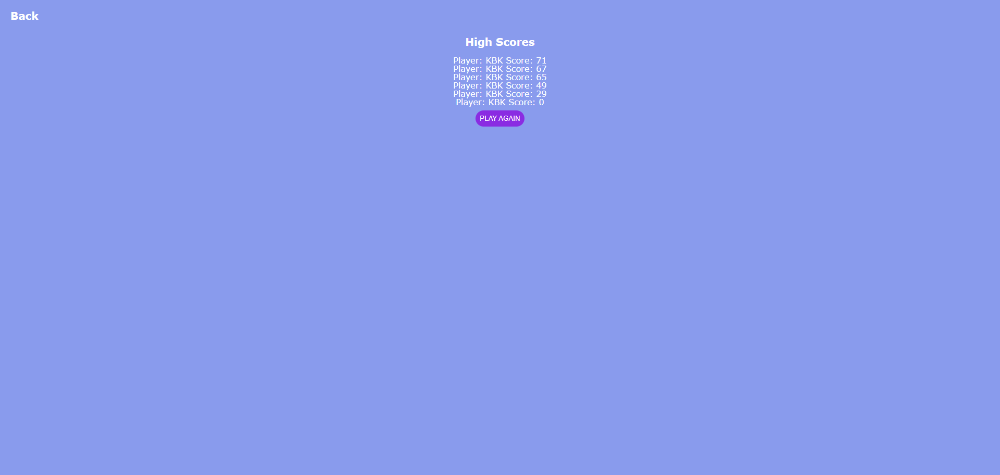

# JavaScript Coding Quiz

## Table of Contents

1. [Description](#description)
2. [Usage](#usage)
3. [Visuals](#visuals)
4. [Resources](#resources)

## Description

Created a JavaScript Quiz from scratch utilizing HTML, JavaScript, and CSS.

Features Include:

- dynamic states for clicking through the page
- a countdown timer that becomes the user's score
- questions marked right or wrong; wrong answers subtract ten seconds from the timer
- the ability to save initials and score to local storage

## Usage
Clicking 'START' will begin the quiz. There will be a countdown timer, and every wrong answer subtracts ten seconds from the timer. After answering all questions, user's score is equivalent to the time left. They will go to a game over screen and can enter initials to save their score. If user runs out of time, they are directed to a game over screen and prompted to enter initials. Local storage saves up to ten sets of initials and scores. 'View High Scores' will take user to the high scores page, but it is disabled during the quiz. At that page, it becomes a 'Back' button to return to the start.

## Visuals
The landing page for the site.

The first question.

The game over page.

The high scores page with local storage.

## Resources
- [Live Site](https://kleylakb89.github.io/04-code-quiz/)
- [Repository](https://github.com/kleylakb89/04-code-quiz)